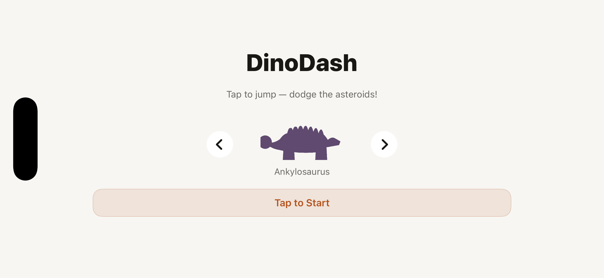
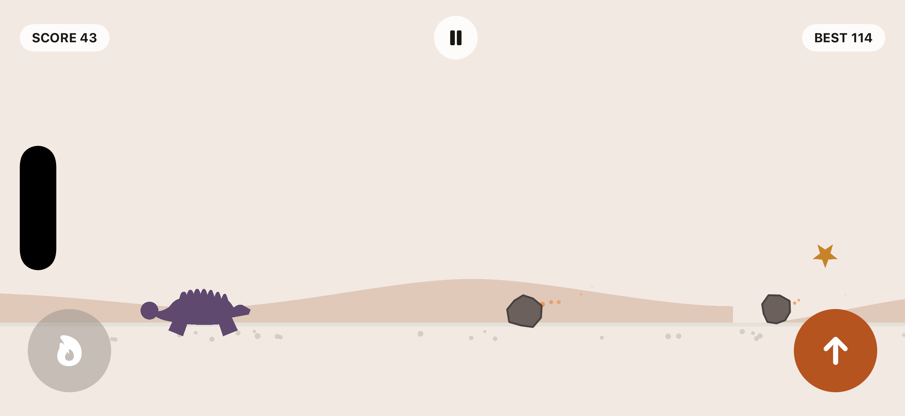

# DinoDash

A simple endless runner for my son — pick a dino (Ankylosaurus by default, or Spinosaurus), then auto-run across the ground, tapping anywhere to jump over asteroids (some you must jump, some you must let pass), with a rising difficulty curve, near-miss bonus points, collectible stars, and a background that shifts from day to dusk to deep space the longer you survive. Inspired by the Chrome offline dino game.

  
  

*(Screenshots are from live Simulator gameplay, not mockups.)*

## How it works

- **Start** — shows your best score (if any), the currently selected dino with left/right arrows to switch characters, and waits for a tap anywhere to begin.
- **Play** — the dino auto-runs; tap anywhere (or the on-screen jump button) to jump, with a whoosh sound effect. Asteroids come in two flavors: ground-level ones you must jump, and elevated ones you must *not* jump into, each trailing small falling embers. Speed and spawn frequency ramp up the longer you survive. Clearing a ground asteroid mid-air by a hair scores a near-miss bonus with a spark effect; collectible stars chime when grabbed mid-jump. Every 100 points, the roar button (bottom-left) lights up — tap it to sweep a shockwave across the screen that clears every current asteroid for a bonus, then it greys out until the next 100. The background gradually shifts from cream daylight to dusk to a starry night as your score climbs.
- **Crash** — a thud, a screen flash, and a haptic thump, then your score and (if beaten) a "New High Score!" callout. Tap anywhere to retry instantly with the same dino, or tap **Change Dino** to head back to the Start screen and pick a different character.
